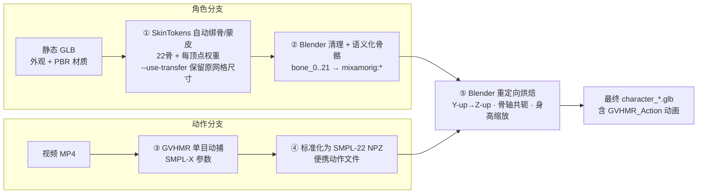

## project description
项目目标：打通一条从“已有视频”到“可用游戏角色”的完整链路：把“视频人物提取、3D 白模生成、角色精修、骨骼绑定、动作复现”串成一个可演示的生产流程。

## 参考资源
- 可能用到的一些技术：@docs/架构设计和技术调研.md
- aholo产品、api等：https://cf.qunhequnhe.com/pages/viewpage.action?pageId=81507925827
- 可调用研发资源清单：https://cf.qunhequnhe.com/pages/viewpage.action?pageId=81507918322
- mesh转换为URDF：http://assemblyeval.qunhequnhe.com/hackday， （上传一个 Mesh，Assembly Agent 会自动生成参考视图，并产出可交互检查和下载的 URDF）

已知的一些开源项目：
- https://zjp-shadow.github.io/works/SkinTokens/
- https://zju3dv.github.io/gvhmr/
- https://github.com/zju3dv/GVHMR

## 项目完整链路（五阶段）

五个阶段由 `run.sh` 一键编排，对应 `pipeline/scripts/` 下的脚本

五阶段独立运行与产物说明见 **[pipeline/五阶段独立运行与产物说明.md](pipeline/五阶段独立运行与产物说明.md)**。

## 已经跑通的案例
- 完整实施计划方案：@docs/视频到可用游戏角色-完整实施方案.md
- 完整运行闭环文档：@docs/原始Lux3D-GLB到动画GLB-完整闭环运行手册.md
- 代码： @pipeline 目录下