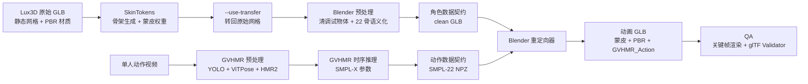
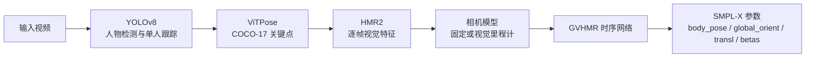

# 原始 Lux3D GLB 到动画 GLB：完整闭环运行手册

> 实际落地链路：Lux3D 静态 GLB → SkinTokens 自动绑骨/蒙皮 → 22 骨语义化与蒙皮验收 → GVHMR 从视频提取人体动作 → SMPL-22 可移植中间格式 → Blender 坐标转换、骨轴重定向、根位移缩放与逐帧烘焙 → 可在游戏引擎播放的动画 GLB。

本文不是概念方案，而是本项目在一台无法联网的远程 RTX 5090 机器上实际执行、调试和验收后沉淀的复现手册。文中的命令、目录、数据结构和故障处理均来自本次 `冰雪射手.glb + GVHMR tennis.mp4` 的完整闭环。

---

## 1. 最终结论

这条路线已经实际跑通，并形成一键脚本：

```text
原始 Lux3D GLB
  ↓
SkinTokens 预测 22 骨骨架与每顶点权重
  ↓ --use-transfer 保留原始 Lux3D 网格、尺寸和 PBR 材质
Blender 清理、语义化骨骼、压力测试
  ↓
视频输入 GVHMR
  ↓
SMPL-X/SMPL-22 每帧局部旋转 + 全局根位移
  ↓
统一 NPZ 动作中间格式
  ↓
Blender Y-up→Z-up、骨轴共轭、身高比例缩放、关键帧烘焙
  ↓
动画 GLB
```

本次推荐最终产物：

```text
本地：pipeline/artifacts/冰雪射手_tennis_full_reproduced.glb
远程：/home/naqi/hackday-character-pipeline/motion/冰雪射手_tennis_full_reproduced.glb
```

验收数据：

| 项目 | 实测结果 |
|---|---:|
| 骨骼数 | 22 |
| 动画帧数 | 312 |
| FPS | 30 |
| 动画时长 | 10.4 秒 |
| 动画名称 | `GVHMR_Action` |
| glTF 动画通道 | 66 |
| glTF 关键帧 | 7,262 |
| 原角色高度 | 0.2600000 模型单位 |
| SMPL-X 源人体高度 | 1.7564653 米 |
| 根位移缩放比例 | 0.1480246 |
| Khronos glTF Validator | 0 error、0 warning |
| 最终文件 SHA-256 | `157F10AE17A0FC7492ABAEF92635525DFCD7F4D2DFBE032CBA854CBB2788AF3B` |

---

## 2. 总体架构与数据流



整条链路被拆成两个相互独立、最后汇合的数据分支：

1. 角色分支负责回答“哪个顶点受哪根骨骼影响”。
2. 动作分支负责回答“每一帧每根人体关节如何旋转、骨盆如何移动”。
3. Blender 重定向器负责将动作分支的数据正确施加到角色分支生成的骨架上。

这样设计的好处是：同一个角色可以复用多个动作，同一个视频动作也可以重定向给多个角色。

---

## 3. 运行环境

### 3.1 远程机器

```text
操作系统：Ubuntu 24.04.4
GPU：NVIDIA GeForce RTX 5090 D v2
显存：约 24 GB
NVIDIA Driver：580.95.05
Blender：4.5.12 LTS
网络：远程机器无法访问互联网
```

### 3.2 已有项目和环境

```text
/home/naqi/SkinTokens
  Python：.venv/bin/python，Python 3.11
  PyTorch：2.7.0+cu128
  检查点：
    experiments/articulation_xl_quantization_256_token_4/grpo_1400.ckpt
    experiments/skin_vae_2_10_32768/last.ckpt

/home/naqi/GVHMR
  Python：.venv310/bin/python，Python 3.10
  PyTorch：2.7.0+cu128
  已有 YOLO、ViTPose、HMR2、GVHMR、SMPL、SMPL-X 检查点

/usr/local/bin/blender
  Blender 4.5.12 LTS
```

远程工作区：

```text
/home/naqi/hackday-character-pipeline
```

本地项目目录：

```text
C:\Users\admin\Desktop\hackday-0807
```

---

## 4. 输入数据要求

### 4.1 Lux3D GLB

推荐：

- 单一完整人物。
- 四肢与身体轮廓清楚，避免手臂完全贴住躯干、双腿粘连。
- 尽量接近 A Pose 或自然站姿；T Pose 最容易重定向。
- 保留 PBR 材质和 UV。
- 角色朝向稳定，模型原点与单位最好可解释。
- 长发、裙摆、披风、武器等配件可以存在，但自动人体 22 骨不会提供完善的二级动力学。

本次原始 `冰雪射手.glb` 的实际结构：

| 项目 | 数值 |
|---|---:|
| 文件大小 | 5,044,836 bytes |
| Mesh | 1 |
| Primitive | 1 |
| 顶点 | 54,391 |
| 三角面 | 59,972 |
| 属性 | POSITION、NORMAL、TEXCOORD_0 |
| 贴图 | 2 张 1024×1024 PNG |
| Skin | 0 |
| Animation | 0 |
| Morph Target | 0 |
| 尺寸范围 | 约 0.1697 × 0.2600 × 0.1593 |

原始模型只有静态网格与材质，不含 `JOINTS_0`、`WEIGHTS_0`、skin、骨骼和动画，无法直接播放人物动作。

### 4.2 动作视频

推荐：

- 单人、全身可见。
- 少遮挡、少切镜、少运动模糊。
- 30 FPS 或可稳定转成 30 FPS。
- 固定机位优先；移动机位也可以，但需启用视觉里程计。
- 人物不要长时间离开画面。
- 脚部可见有助于根运动与接地判断。

本次使用 GVHMR 自带样例：

```text
/home/naqi/GVHMR/docs/example_video/tennis.mp4
312 帧，10.4 秒，812×720
```

---

## 5. 目录布局与文件职责

本地实现文件：

```text
hackday-character-pipeline/
├── run_remote_pipeline.sh          # 唯一运行入口
├── README.md
├── inputs/                         # 上传视频和原始 GLB
├── runs/                           # 运行时生成，已加入 .gitignore
└── pipeline/
    ├── README.md
    ├── config/
    │   └── skintokens_mixamo_mapping.json
    ├── scripts/
    │   ├── run_skintokens_offline.py
    │   ├── inspect_rig.py
    │   ├── prepare_and_test_rig.py
    │   ├── extract_gvhmr_motion.py
    │   └── apply_gvhmr_motion.py
    └── artifacts/
    ├── 冰雪射手_rigged_transfer_reproduced.glb
    ├── 冰雪射手_rigged_transfer_clean.glb
    ├── 冰雪射手_rigged_transfer_test.glb
    ├── tennis_gvhmr_smpl22.npz
    ├── 冰雪射手_tennis_full_reproduced.glb
    ├── gvhmr_tennis_incam.mp4
    ├── gvhmr_tennis_global.mp4
    └── *.png / *.json
```

远程执行时，每个 run 目录结构如下：

```text
<output_dir>/
├── rigging/
│   ├── character_rigged_raw.glb
│   ├── character_rigged_clean.glb
│   └── character_rig_test.glb
├── motion/
│   ├── gvhmr/<video_stem>/
│   │   ├── 0_input_video.mp4
│   │   ├── 1_incam.mp4
│   │   ├── 2_global.mp4
│   │   ├── hmr4d_results.pt
│   │   └── preprocess/*.pt
│   ├── <video_stem>_smpl22.npz
│   ├── <video_stem>_motion_manifest.json
│   ├── <video_stem>_retarget_report.json
│   └── character_<video_stem>_animated.glb
├── renders/
│   ├── rig_test/*.png
│   └── retarget/*.png
└── logs/
    ├── 01_skintokens.log
    ├── 02_prepare_rig.log
    ├── 03_gvhmr.log
    ├── 04_extract_motion.log
    └── 05_retarget.log
```

建议每次用新的 `<output_dir>`，以便保留日志和中间文件。GVHMR 会复用同一输出目录下已有的预处理和推理缓存。

---

## 6. 离线机器的素材上传

远程机器无法联网，因此视频、角色和本项目脚本需要从本地上传。

Windows PowerShell：

```powershell
scp -P 30704 "C:\path\character.glb" `
  naqi@moon-devbox-zw.qunhequnhe.com:/home/naqi/hackday-character-pipeline/inputs/

scp -P 30704 "C:\path\action.mp4" `
  naqi@moon-devbox-zw.qunhequnhe.com:/home/naqi/hackday-character-pipeline/inputs/
```

上传后确认：

```bash
ls -lh /home/naqi/hackday-character-pipeline/inputs
sha256sum /home/naqi/hackday-character-pipeline/inputs/character.glb
```

不要把 SSH 密码写入脚本、仓库或文档。交互式 `scp/ssh` 输入密码即可，正式使用建议配置 SSH Key。

---

## 7. 一键运行

### 7.1 固定机位视频

```bash
cd /home/naqi/hackday-character-pipeline

bash run_remote_pipeline.sh \
  /home/naqi/hackday-character-pipeline/inputs/action.mp4 \
  /home/naqi/hackday-character-pipeline/inputs/character.glb \
  /home/naqi/hackday-character-pipeline/runs/action_character \
  static
```

### 7.2 移动机位视频

```bash
cd /home/naqi/hackday-character-pipeline

bash run_remote_pipeline.sh \
  /home/naqi/hackday-character-pipeline/inputs/action.mp4 \
  /home/naqi/hackday-character-pipeline/inputs/character.glb \
  /home/naqi/hackday-character-pipeline/runs/action_character_moving \
  moving
```

模式区别：

- `static` 会给 GVHMR 加 `--static_cam`，跳过视觉里程计；固定机位最稳定。
- `moving` 不加 `--static_cam`，GVHMR 使用 SimpleVO 估计相机运动。

成功后主要结果：

```text
<output_dir>/motion/character_<video_stem>_animated.glb
```

---

## 8. 阶段一：SkinTokens 自动绑骨与蒙皮

### 8.1 目标

将只有静态网格的 Lux3D GLB 转为包含以下内容的 GLB：

- Armature / Skeleton。
- 22 根人体骨骼。
- 每顶点骨骼索引 `JOINTS_0`。
- 每顶点骨骼权重 `WEIGHTS_0`。
- inverse bind matrices。
- 原始 PBR 材质与贴图。

### 8.2 为什么必须使用 `--use-transfer`

SkinTokens 默认直接导出内部归一化网格。本次实测：

| 模式 | 顶点/文件表现 | 适用性 |
|---|---|---|
| 默认导出 | 三角角点展开为约 179,898 顶点，人物归一化到约 2 米，文件约 8.64 MB | 适合模型内部结果查看，不适合直接替换原 Lux3D 资产 |
| `--use-transfer` | 权重转回原始 Lux3D 网格，保留约 0.26 高度、PBR 材质与紧凑拓扑，文件约 5.79 MB | 本项目生产选择 |

所以流水线固定启用：

```text
--use-transfer
```

### 8.3 离线冷启动包装器

SkinTokens 原 `demo.py` 的 Blender HTTP 子服务等待时间硬编码为 30 秒：

```python
def wait_for_bpy_server(timeout=30):
    ...
```

远程 `/home` 位于网络存储，冷启动完整 `bpy_server.py` 实测需要约 80–90 秒。服务本身最终能够正常启动，但原 CLI 会在 30 秒时误判失败。

项目没有修改 SkinTokens 仓库，而是新增：

```text
pipeline/scripts/run_skintokens_offline.py
```

它执行：

1. 将 SkinTokens 根目录加入 `sys.path`。
2. 复用原项目 `start_bpy_server()`。
3. 默认等待最多 600 秒，并每 10 秒输出进度；子进程提前退出时立即报告退出码。
4. 复用原项目 `run_cli()`。
5. 默认使用原模型检查点和生成参数。

独立运行命令：

```bash
cd /home/naqi/SkinTokens

.venv/bin/python -u \
  /home/naqi/hackday-character-pipeline/pipeline/scripts/run_skintokens_offline.py \
  --skintokens-home /home/naqi/SkinTokens \
  --input /home/naqi/hackday-character-pipeline/inputs/character.glb \
  --output /home/naqi/hackday-character-pipeline/rigging/character_rigged_raw.glb \
  --use-transfer
```

### 8.4 实测耗时

- 网络盘双进程冷启动：可能 2–4 分钟。
- 检查点加载：受网络盘缓存影响。
- RTX 5090 实际单模型生成与导出：约 18 秒。
- 推理时 GPU 显存占用观察值：约 3 GB 起，随阶段变化。

冷启动慢并不代表 GPU 推理慢。判断是否正常应观察：

```text
[Main] bpy_server is ready
Loading model: ...grpo_1400.ckpt
0%|...| 0/1
[OK] Exported: ...glb
```

---

## 9. 阶段二：骨骼检查、清理和语义化

SkinTokens 输出的骨骼名称是：

```text
bone_0 ... bone_21
```

名字没有语义，不能直接与 SMPL、Mixamo 或游戏逻辑建立稳定映射。因此需要根据稳定的骨架拓扑赋予语义名。

### 9.1 先验收再重命名

检查脚本：

```text
pipeline/scripts/inspect_rig.py
```

执行：

```bash
/usr/local/bin/blender --background \
  --python /home/naqi/hackday-character-pipeline/pipeline/scripts/inspect_rig.py -- \
  --input /path/character_rigged_raw.glb \
  --output /path/character_rig_summary.json
```

它检查：

- Armature 数量。
- 骨骼总数和根骨数量。
- 每根骨骼的父节点、head、tail、长度。
- Mesh 数量和 Armature Modifier。
- vertex group 数量。
- 无权重顶点数量。
- 每顶点 1/2/3/4 骨影响的分布。
- 每个骨组影响的顶点数量和权重和。

本次 `--use-transfer` 结果满足：

```text
armature_count = 1
bone_count = 22
root_bones = [bone_0]
vertex_group_count = 22
unweighted_vertex_count = 0
每顶点最多 4 根骨骼
```

### 9.2 完整 22 骨映射

配置文件：

```text
pipeline/config/skintokens_mixamo_mapping.json
```

SkinTokens、目标语义骨和 SMPL-22 的完整对应关系：

| SkinTokens | 目标语义名 | SMPL-22 索引 | SMPL 关节 |
|---|---|---:|---|
| `bone_0` | `mixamorig:Hips` | 0 | pelvis |
| `bone_1` | `mixamorig:Spine` | 3 | spine1 |
| `bone_2` | `mixamorig:Spine1` | 6 | spine2 |
| `bone_3` | `mixamorig:Spine2` | 9 | spine3 |
| `bone_4` | `mixamorig:Neck` | 12 | neck |
| `bone_5` | `mixamorig:Head` | 15 | head |
| `bone_6` | `mixamorig:LeftShoulder` | 13 | left_collar |
| `bone_7` | `mixamorig:LeftArm` | 16 | left_shoulder |
| `bone_8` | `mixamorig:LeftForeArm` | 18 | left_elbow |
| `bone_9` | `mixamorig:LeftHand` | 20 | left_wrist |
| `bone_10` | `mixamorig:RightShoulder` | 14 | right_collar |
| `bone_11` | `mixamorig:RightArm` | 17 | right_shoulder |
| `bone_12` | `mixamorig:RightForeArm` | 19 | right_elbow |
| `bone_13` | `mixamorig:RightHand` | 21 | right_wrist |
| `bone_14` | `mixamorig:LeftUpLeg` | 1 | left_hip |
| `bone_15` | `mixamorig:LeftLeg` | 4 | left_knee |
| `bone_16` | `mixamorig:LeftFoot` | 7 | left_ankle |
| `bone_17` | `mixamorig:LeftToeBase` | 10 | left_foot |
| `bone_18` | `mixamorig:RightUpLeg` | 2 | right_hip |
| `bone_19` | `mixamorig:RightLeg` | 5 | right_knee |
| `bone_20` | `mixamorig:RightFoot` | 8 | right_ankle |
| `bone_21` | `mixamorig:RightToeBase` | 11 | right_foot |

### 9.3 清理和压力测试

执行脚本：

```text
pipeline/scripts/prepare_and_test_rig.py
```

独立执行：

```bash
/usr/local/bin/blender --background \
  --python /home/naqi/hackday-character-pipeline/pipeline/scripts/prepare_and_test_rig.py -- \
  --input /path/character_rigged_raw.glb \
  --mapping /home/naqi/hackday-character-pipeline/pipeline/config/skintokens_mixamo_mapping.json \
  --clean-output /path/character_rigged_clean.glb \
  --animated-output /path/character_rig_test.glb \
  --render-dir /path/renders/rig_test
```

脚本做了五件事：

1. 只保留真正绑定到 Armature 的 Mesh。
2. 删除 SkinTokens 导出的额外 `Icosphere` 调试物体。
3. 将 `bone_0 ... bone_21` 改为 Mixamo 风格语义名。
4. 解除 skinned mesh 对 Armature 节点的普通父子关系，同时保留 Armature Modifier，消除 glTF 的 `NODE_SKINNED_MESH_NON_ROOT` 警告。
5. 生成 `RigStressTest` 动画，旋转手臂、前臂、大腿、小腿和胸椎，渲染前/后/左/三分之四视图。

压力测试不是最终动作，而是一个快速质量门禁：如果手脚不动、身体爆炸、配件飞走或出现大量拉丝，就不应继续进入 GVHMR 重定向。

### 9.4 本阶段数据契约

`character_rigged_clean.glb` 必须满足：

- 1 个 Armature。
- 22 根已语义化骨骼。
- 至少 1 个 skinned mesh。
- `JOINTS_0` 与 `WEIGHTS_0` 存在。
- 每顶点最多 4 骨影响。
- 无未加权顶点。
- PBR 材质和贴图仍存在。
- 无不需要的动画。
- glTF Validator 无 error、无 warning。

---

## 10. 阶段三：GVHMR 从视频提取动作

### 10.1 GVHMR 内部流程



实际预处理输出：

```text
preprocess/bbx.pt
preprocess/vitpose.pt
preprocess/vit_features.pt
```

核心输出：

```text
hmr4d_results.pt
```

可视化输出：

```text
1_incam.mp4
2_global.mp4
```

### 10.2 固定机位运行

```bash
cd /home/naqi/GVHMR

env \
  PYTHONPATH=/home/naqi/GVHMR \
  TORCH_FORCE_NO_WEIGHTS_ONLY_LOAD=1 \
  .venv310/bin/python tools/demo/demo.py \
    --video /absolute/path/action.mp4 \
    --output_root /absolute/path/motion/gvhmr \
    --static_cam
```

### 10.3 移动机位运行

去掉 `--static_cam`：

```bash
cd /home/naqi/GVHMR

env \
  PYTHONPATH=/home/naqi/GVHMR \
  TORCH_FORCE_NO_WEIGHTS_ONLY_LOAD=1 \
  .venv310/bin/python tools/demo/demo.py \
    --video /absolute/path/action.mp4 \
    --output_root /absolute/path/motion/gvhmr
```

### 10.4 两个必要兼容项

#### 兼容项 A：`PYTHONPATH`

直接运行 `tools/demo/demo.py` 时，脚本目录是 `tools/demo`，远程 venv 没有把仓库根目录安装成包，因此最初出现：

```text
ModuleNotFoundError: No module named 'hmr4d'
```

解决：

```bash
PYTHONPATH=/home/naqi/GVHMR
```

#### 兼容项 B：PyTorch 2.6+ `weights_only` 默认值

远程是 PyTorch 2.7，加载 YOLO 等受信任的本地旧检查点时，最初出现：

```text
_pickle.UnpicklingError: Weights only load failed
```

原因是 PyTorch 2.6 起 `torch.load` 的默认行为变严格。项目检查点来自已有可信仓库，因此使用官方兼容环境变量：

```bash
TORCH_FORCE_NO_WEIGHTS_ONLY_LOAD=1
```

这避免直接修改 GVHMR、Ultralytics、ViTPose 和 HMR2 的多处 `torch.load` 调用。

### 10.5 实测性能

对 312 帧、10.4 秒视频：

| 阶段 | 实测时间 |
|---|---:|
| 视频复制/标准化 | 约 4 秒 |
| YOLO + ViTPose + HMR2 全部预处理 | 74.36 秒 |
| GVHMR 核心时序推理 | 4.01 秒 |
| Incam 渲染 | 约 12 秒 |
| Global 渲染 | 约 9 秒 |

关键结论：真正的 GVHMR 时序网络很快，主要时间在检测、姿态、特征和首次加载。

### 10.6 缺少 ffmpeg 的降级处理

远程系统没有 `ffmpeg` CLI。GVHMR 在生成 `1_incam.mp4`、`2_global.mp4` 和 `hmr4d_results.pt` 后，最后尝试横向拼接视频时会报：

```text
FileNotFoundError: No such file or directory: 'ffmpeg'
```

这只是可视化拼接失败，不影响动作数据。一键脚本的策略是：

- 如果 `hmr4d_results.pt` 不存在，判定 GVHMR 失败并停止。
- 如果 `hmr4d_results.pt` 已存在但 demo 非零退出，只警告并继续。

生产环境可额外安装/上传静态 ffmpeg，以恢复横向拼接，但它不是动作链路的必需依赖。

---

## 11. 阶段四：将 GVHMR 输出标准化为 SMPL-22 NPZ

### 11.1 为什么需要中间格式

`hmr4d_results.pt` 是 Python/PyTorch 特定 pickle：

- 强依赖 GVHMR 代码和 PyTorch 版本。
- 包含大量网络中间输出。
- Blender Python 不适合直接加载远程 GVHMR venv 中的复杂对象。
- 不便于动作缓存、复用、调试和跨角色重定向。

因此将它转成只包含重定向所需数据的压缩 NPZ。

执行脚本：

```text
pipeline/scripts/extract_gvhmr_motion.py
```

命令：

```bash
cd /home/naqi/GVHMR

env \
  PYTHONPATH=/home/naqi/GVHMR \
  TORCH_FORCE_NO_WEIGHTS_ONLY_LOAD=1 \
  .venv310/bin/python \
    /home/naqi/hackday-character-pipeline/pipeline/scripts/extract_gvhmr_motion.py \
    --input /path/hmr4d_results.pt \
    --output /path/action_smpl22.npz \
    --manifest /path/action_motion_manifest.json
```

### 11.2 输入兼容

GVHMR 本次实际输出：

```text
body_pose:      [312, 63]   # 21 个关节 × 3 轴角，压平
global_orient:  [312, 3]    # 根关节轴角
transl:         [312, 3]    # 全局平移
betas:          [312, 10]   # 体型
```

最初按 `[F, 21, 3]` 理解 `body_pose` 会失败。转换器现在兼容：

- `[F, 63]` 压平轴角。
- `[F, J, 3]` 关节轴角。
- `[F, J, 4]` 四元数。
- `[F, J, 3, 3]` 旋转矩阵。

所有格式统一为：

```text
rotations: [F, 22, 3, 3]
```

### 11.3 NPZ 数据契约

本次 `tennis_gvhmr_smpl22.npz`：

| 字段 | Shape / 类型 | 含义 |
|---|---|---|
| `rotations` | `[312, 22, 3, 3] float32` | 每帧 22 个 SMPL 局部旋转矩阵 |
| `translations` | `[312, 3] float32` | 每帧根平移 |
| `source_height` | scalar float32 | 源 SMPL-X 人体高度，1.7564653 |
| `fps` | scalar float32 | 30 |
| `joint_names` | `[22] string` | 标准关节名 |

压缩后文件约 233 KB，适合缓存和跨角色复用。

### 11.4 源人体高度

转换器用相同 `smpl_params_global` 实例化 GVHMR 的 `supermotion` SMPL-X 模型，从第一帧顶点计算：

```text
source_height = max(vertices[:, Y]) - min(vertices[:, Y])
```

GVHMR/SMPL-X 是 Y-up，因此使用 Y 轴。本次得到：

```text
1.7564653 m
```

---

## 12. 阶段五：Blender 动作重定向与烘焙

执行脚本：

```text
pipeline/scripts/apply_gvhmr_motion.py
```

命令：

```bash
/usr/local/bin/blender --background \
  --python /home/naqi/hackday-character-pipeline/pipeline/scripts/apply_gvhmr_motion.py -- \
  --character /path/character_rigged_clean.glb \
  --motion /path/action_smpl22.npz \
  --output /path/character_action_animated.glb \
  --report /path/action_retarget_report.json \
  --preview-dir /path/renders/retarget
```

重定向不是简单地把 SMPL 的四元数原样赋给目标骨骼。必须同时处理：

1. 关节语义映射。
2. Y-up 与 Z-up 坐标差异。
3. 源骨与目标骨静态局部轴方向不同。
4. 源人体与目标角色高度不同。
5. 根位移的零点、比例和根骨本地坐标。
6. glTF skinned mesh 节点结构。

### 12.1 坐标系变换

GVHMR/SMPL-X：

```text
X：右
Y：上
Z：前
```

Blender：

```text
X：右
Y：后
Z：上
```

使用坐标变换矩阵：

```text
    [1  0  0]
C = [0  0 -1]
    [0  1  0]
```

点和位移：

```text
p_blender = C · p_smpl
```

旋转矩阵：

```text
R_blender = C · R_smpl · C⁻¹
```

因为 C 是正交矩阵：

```text
C⁻¹ = Cᵀ
```

### 12.2 静态骨轴共轭

SMPL 关节旋转表达在 SMPL 的局部关节坐标中；SkinTokens/Blender 每根骨骼的静态局部轴不相同。如果直接赋值，手臂可能绕错误轴旋转。

对目标骨骼，先计算它相对父骨的静态局部旋转：

```text
R_rest_local = inverse(parent.matrix_local) · bone.matrix_local
```

根骨使用自身 `matrix_local`。

然后将已经转换到 Blender 模型空间的源旋转共轭到目标骨本地轴：

```text
R_basis = R_rest_local⁻¹ · R_blender · R_rest_local
```

再把 `R_basis` 转成四元数，写入：

```python
pose_bone.rotation_mode = "QUATERNION"
pose_bone.rotation_quaternion = R_basis.to_quaternion()
pose_bone.keyframe_insert(data_path="rotation_quaternion", frame=frame)
```

这是动作能正确落在 SkinTokens 任意静态骨轴上的关键。

### 12.3 根位移比例

源动作的人体约 1.7564653 米，目标 Lux3D 角色高度为 0.26 模型单位。位移不能原样复制，否则角色会移动约 7.7 倍过远。

比例：

```text
scale = target_height / source_height
      = 0.2600000 / 1.7564653
      = 0.1480246
```

以第一帧为局部原点：

```text
Δt_i = translation_i - translation_0
```

转换与缩放：

```text
d_i = C · Δt_i · scale
```

根骨 `PoseBone.location` 又位于根骨静态局部坐标，因此最后计算：

```text
root.location = R_root_rest⁻¹ · d_i
```

### 12.4 为什么从 GLB JSON 读取角色高度

Blender 重新导入 skinned GLB 后，可能为了骨骼绑定内部处理而出现导入用对象缩放：

- `bound_box` 曾返回默认 2 米范围。
- 直接读 `mesh.data.vertices` 也可能位于归一化绑定空间。
- 实际 glTF 可见角色仍高约 0.26。

如果用 Blender 对象包围盒计算比例，本次曾得到错误值：

```text
target_height = 2.0
scale = 1.1386504
```

结果是根位移被放大，预览镜头也拉得极远。

最终实现直接读取 GLB JSON chunk 中 POSITION accessor 的 `min/max`。glTF 是 Y-up，所以：

```text
target_height = POSITION.max[Y] - POSITION.min[Y]
```

本次准确得到：

```text
0.2600000
```

这一方法与最终 glTF runtime 实际显示的坐标一致。

### 12.5 烘焙策略

每帧写入：

- 22 根骨骼的 `rotation_quaternion`。
- `mixamorig:Hips` 的 `location`。

312 帧、30 FPS 最终导出为一条：

```text
GVHMR_Action
```

导出参数：

```text
GLB
export_skins = true
export_animations = true
export_morph = false
export_yup = true
```

最终导出前再次解除 skinned mesh 的普通父子关系，但保留 Armature Modifier，确保 glTF Validator 不再报告：

```text
NODE_SKINNED_MESH_NON_ROOT
```

### 12.6 QA 预览

默认渲染动作帧：

```text
1
F / 3
2F / 3
```

本次是：

```text
1、104、208
```

使用 Cycles 离屏渲染。最初 Eevee 在无桌面服务器上因缺少 `libEGL.so.1` 失败；Cycles 不依赖该 EGL 路径，因此成为远程 QA 的稳定选择。

---

## 13. 一键脚本内部五个阶段

根目录 `run_remote_pipeline.sh` 按以下顺序执行，并根据自身位置定位 `pipeline/scripts` 与 `pipeline/config`：

### `[1/5] SkinTokens automatic rigging`

输入：

```text
character.glb
```

输出：

```text
rigging/character_rigged_raw.glb
```

关键选项：

```text
--use-transfer
--server-timeout 600
```

### `[2/5] Clean rig and assign semantic names`

输入：

```text
character_rigged_raw.glb
```

输出：

```text
character_rigged_clean.glb
character_rig_test.glb
renders/rig_test/*.png
```

### `[3/5] GVHMR video-to-motion`

输入：

```text
action.mp4
```

输出：

```text
motion/gvhmr/<video_stem>/hmr4d_results.pt
```

### `[4/5] Convert to portable SMPL-22 motion`

输入：

```text
hmr4d_results.pt
```

输出：

```text
<video_stem>_smpl22.npz
<video_stem>_motion_manifest.json
```

### `[5/5] Retarget and bake`

输入：

```text
character_rigged_clean.glb
<video_stem>_smpl22.npz
```

输出：

```text
character_<video_stem>_animated.glb
<video_stem>_retarget_report.json
renders/retarget/*.png
```

---

## 14. 分阶段手动执行清单

如果一键脚本失败，可按以下顺序手动执行并定位故障。

### 14.1 设置变量

```bash
WORK=/home/naqi/hackday-character-pipeline
RUN=$WORK/runs/manual_test
VIDEO=$WORK/inputs/action.mp4
CHARACTER=$WORK/inputs/character.glb

mkdir -p "$RUN"/{rigging,motion,renders,logs}
```

### 14.2 SkinTokens

```bash
cd /home/naqi/SkinTokens

.venv/bin/python -u "$WORK/scripts/run_skintokens_offline.py" \
  --skintokens-home /home/naqi/SkinTokens \
  --input "$CHARACTER" \
  --output "$RUN/rigging/character_rigged_raw.glb" \
  --use-transfer \
  2>&1 | tee "$RUN/logs/01_skintokens.log"
```

### 14.3 骨骼清理与测试

```bash
/usr/local/bin/blender --background \
  --python "$WORK/scripts/prepare_and_test_rig.py" -- \
  --input "$RUN/rigging/character_rigged_raw.glb" \
  --mapping "$WORK/scripts/skintokens_mixamo_mapping.json" \
  --clean-output "$RUN/rigging/character_rigged_clean.glb" \
  --animated-output "$RUN/rigging/character_rig_test.glb" \
  --render-dir "$RUN/renders/rig_test" \
  2>&1 | tee "$RUN/logs/02_prepare_rig.log"
```

### 14.4 GVHMR

```bash
cd /home/naqi/GVHMR

env PYTHONPATH=/home/naqi/GVHMR \
  TORCH_FORCE_NO_WEIGHTS_ONLY_LOAD=1 \
  .venv310/bin/python tools/demo/demo.py \
    --video "$VIDEO" \
    --output_root "$RUN/motion/gvhmr" \
    --static_cam \
    2>&1 | tee "$RUN/logs/03_gvhmr.log"
```

如果最后只因 `ffmpeg` 失败，确认核心文件存在：

```bash
ls -lh "$RUN/motion/gvhmr/$(basename "${VIDEO%.*}")/hmr4d_results.pt"
```

实际 shell 中更稳妥地先计算：

```bash
VIDEO_BASE=$(basename "$VIDEO")
VIDEO_STEM=${VIDEO_BASE%.*}
GVHMR_RESULT="$RUN/motion/gvhmr/$VIDEO_STEM/hmr4d_results.pt"
ls -lh "$GVHMR_RESULT"
```

### 14.5 转成 NPZ

```bash
cd /home/naqi/GVHMR

env PYTHONPATH=/home/naqi/GVHMR \
  TORCH_FORCE_NO_WEIGHTS_ONLY_LOAD=1 \
  .venv310/bin/python "$WORK/scripts/extract_gvhmr_motion.py" \
    --input "$GVHMR_RESULT" \
    --output "$RUN/motion/${VIDEO_STEM}_smpl22.npz" \
    --manifest "$RUN/motion/${VIDEO_STEM}_motion_manifest.json" \
    2>&1 | tee "$RUN/logs/04_extract_motion.log"
```

### 14.6 Blender 重定向

```bash
/usr/local/bin/blender --background \
  --python "$WORK/scripts/apply_gvhmr_motion.py" -- \
  --character "$RUN/rigging/character_rigged_clean.glb" \
  --motion "$RUN/motion/${VIDEO_STEM}_smpl22.npz" \
  --output "$RUN/motion/character_${VIDEO_STEM}_animated.glb" \
  --report "$RUN/motion/${VIDEO_STEM}_retarget_report.json" \
  --preview-dir "$RUN/renders/retarget" \
  2>&1 | tee "$RUN/logs/05_retarget.log"
```

---

## 15. 质量门禁与验收标准

### 15.1 原始 GLB 门禁

- 能被 Blender 或 glTF 工具读取。
- 至少一个 mesh primitive。
- POSITION/NORMAL/UV 正常。
- PBR 贴图没有丢失。
- 尺寸非零。
- 无损坏的 bufferView/accessor。

### 15.2 绑骨门禁

- 1 个 Armature。
- 22 根人体骨。
- 只有一个根骨 `bone_0`。
- 22 个对应 vertex group。
- 0 个未加权顶点。
- 每顶点最多 4 个正权重。
- 压力测试中手臂、腿、躯干均能变形。
- 原材质和纹理仍在。

### 15.3 动作门禁

NPZ 至少满足：

```text
rotations.shape == [F, 22, 3, 3]
translations.shape == [F, 3]
F > 0
fps > 0
source_height > 0
```

同时检查：

- 旋转矩阵没有 NaN/Inf。
- 平移没有 NaN/Inf。
- 视频帧数与动作帧数一致或有明确重采样策略。
- 脚部和根位移没有明显爆跳。

### 15.4 最终 GLB 门禁

- Skin、JOINTS_0、WEIGHTS_0 仍存在。
- 22 个语义关节仍存在。
- 至少一条 animation。
- 动画名为 `GVHMR_Action`。
- 动画 duration 与报告一致。
- PBR 材质、两张纹理仍存在。
- 三个关键帧渲染有明显动作变化。
- Khronos glTF Validator 为 0 error、0 warning。

本地验证命令：

```powershell
npx --yes @gltf-transform/cli validate `
  "pipeline\artifacts\冰雪射手_tennis_full_reproduced.glb"

npx --yes @gltf-transform/cli inspect `
  "pipeline\artifacts\冰雪射手_tennis_full_reproduced.glb"

Get-FileHash `
  "pipeline\artifacts\冰雪射手_tennis_full_reproduced.glb" `
  -Algorithm SHA256
```

---

## 16. 本次完整执行中的故障与修复

| 问题 | 症状 | 根因 | 最终处理 |
|---|---|---|---|
| GVHMR 无法导入 `hmr4d` | `ModuleNotFoundError` | 仓库根目录未进入模块路径 | 显式设置 `PYTHONPATH=/home/naqi/GVHMR` |
| YOLO 检查点无法加载 | `Weights only load failed` | PyTorch 2.7 新默认行为 | `TORCH_FORCE_NO_WEIGHTS_ONLY_LOAD=1` |
| SkinTokens bpy server 启动失败 | 30/180 秒后超时 | 不同容器的网络盘冷启动可能超过 3 分钟 | 包装器默认等待 600 秒、输出进度并监测子进程；可用 `SKINTOKENS_SERVER_TIMEOUT=900` 延长 |
| SkinTokens 默认结果变大且归一化 | 8.64 MB、179,898 顶点、约 2 米 | 默认导出内部展开网格 | 使用 `--use-transfer` 转回原 Lux3D 网格 |
| SkinTokens 多出 Icosphere | GLB 含额外 42 顶点调试球 | 导出残留 | 只保留绑定 Armature 的 skinned mesh |
| 预览 Eevee 崩溃 | 缺少 `libEGL.so.1` | 无桌面服务器缺 EGL | 使用 Cycles 离屏渲染 |
| GVHMR body pose 格式失败 | `(312, 63)` 不被识别 | 轴角被压平 | 转换器兼容压平轴角、关节轴角、四元数、矩阵 |
| 根位移放大约 7.7 倍 | 角色移出镜头 | Blender 导入绑定空间包围盒误报 2 米 | 从 GLB POSITION accessor 读取真实 0.26 高度 |
| glTF Validator 警告 | `NODE_SKINNED_MESH_NON_ROOT` | skinned mesh 同时作为 Armature 普通子节点 | 导出前解除普通 parent，保留 Armature Modifier |
| GVHMR 最后退出失败 | 找不到 `ffmpeg` | 仅横向拼接需要 CLI | 以 `hmr4d_results.pt` 是否存在判断核心成功 |

这些兼容逻辑都已经固化在一键脚本或 Python 脚本中，不需要每次手工修改第三方仓库。

---

## 17. 结果如何在游戏端播放

最终 GLB 是标准 glTF 2.0，包含一条动画。Three.js 示例：

```javascript
import * as THREE from "three";
import { GLTFLoader } from "three/addons/loaders/GLTFLoader.js";

const loader = new GLTFLoader();

loader.load("/models/character_action_animated.glb", (gltf) => {
  scene.add(gltf.scene);

  const mixer = new THREE.AnimationMixer(gltf.scene);
  const clip = gltf.animations.find((item) => item.name === "GVHMR_Action")
    ?? gltf.animations[0];

  mixer.clipAction(clip).play();

  clock.start();
  renderer.setAnimationLoop(() => {
    mixer.update(clock.getDelta());
    renderer.render(scene, camera);
  });
});
```

Unity、Unreal、Babylon.js 同样可读取 GLB/GLTF 动画；需要特别检查：

- 引擎导入单位与角色原始单位。
- Root Motion 是交给动画移动角色，还是烘焙/移除后由游戏逻辑驱动。
- 动画循环、首尾过渡和地面接触。
- 材质颜色空间、金属粗糙度贴图通道。

---

## 18. 当前能力边界

### 已完成

- 原始 Lux3D GLB 自动生成 22 骨骨架。
- 自动生成每顶点蒙皮权重。
- 权重回传原 Lux3D 网格，保留尺寸与 PBR。
- 骨骼语义化。
- 从视频提取 3D 人体时序动作。
- 将 GVHMR 动作转为独立 SMPL-22 数据。
- 跨坐标系、跨静态骨轴、跨身高重定向。
- 烘焙为标准动画 GLB。
- 远程离线一键执行。
- 关键帧渲染与 glTF Validator 验收。

### 仍需生产化优化

1. **配件与二级骨骼**：长发、裙摆、披风、弓、箭袋只依赖人体 22 骨时会随身体变形。正式资产应增加辅助骨、刚性权重或物理骨。
2. **手指和面部**：当前 22 骨不包含手指、眼睛、下颌和表情。
3. **接地和脚滑**：可增加脚底锁定、IK、grounding、root trajectory 平滑。
4. **动作去抖**：对低质量视频可在旋转空间做低通滤波或四元数平滑。
5. **Root Motion 策略**：游戏中常需拆成原地动画和独立根轨迹。
6. **多角色和遮挡**：当前 GVHMR demo 走单人 track。
7. **动作裁剪与循环**：正式使用需要剪辑、首尾对齐、循环过渡。
8. **资产减面与纹理压缩**：可增加 Draco/Meshopt、KTX2/BasisU 和 LOD。

---

## 19. 推荐的下一阶段工程化结构

建议将现有脚本升级为任务化服务：

```text
Job API
  ├── upload character/video
  ├── rigging worker
  ├── motion worker
  ├── retarget worker
  ├── QA/validator worker
  └── artifact registry
```

每个 Job 记录：

- 输入文件 hash。
- SkinTokens/GVHMR commit 或版本。
- 检查点 hash。
- Blender 版本。
- 每阶段开始/结束时间。
- 中间文件路径和 hash。
- 骨骼/权重/动作报告。
- 最终 Validator 结果。

建议状态机：

```text
UPLOADED
→ RIGGING
→ RIG_VALIDATED
→ MOTION_EXTRACTING
→ MOTION_VALIDATED
→ RETARGETING
→ FINAL_VALIDATED
→ READY
```

任一阶段失败都保留日志和中间产物，可以从最近的有效数据契约继续，而不必重跑全部 GPU 阶段。

---

## 20. 快速交接清单

交给下一位开发者时，只需确认：

1. 远程存在 `/home/naqi/SkinTokens` 及检查点。
2. 远程存在 `/home/naqi/GVHMR` 及检查点。
3. `/usr/local/bin/blender` 可运行。
4. 整个项目已按原目录结构复制到 `/home/naqi/hackday-character-pipeline`。
5. 视频和角色已上传到远程。
6. 选择 `static` 或 `moving`。
7. 使用新的 run 输出目录执行一键命令。
8. 检查五份日志。
9. 查看 rig test 与 retarget 关键帧。
10. 用 glTF Validator 检查最终 GLB。

最简运行入口：

```bash
cd /home/naqi/hackday-character-pipeline

bash run_remote_pipeline.sh \
  /absolute/path/action.mp4 \
  /absolute/path/character.glb \
  /home/naqi/hackday-character-pipeline/runs/my_run \
  static
```

最重要的最终文件：

```text
/home/naqi/hackday-character-pipeline/runs/my_run/motion/character_action_animated.glb
```

---

## 21. 本次实测产物索引

| 产物 | 作用 |
|---|---|
| `pipeline/artifacts/冰雪射手_rigged_transfer_reproduced.glb` | 本次实际重新运行 SkinTokens `--use-transfer` 的原始绑定结果 |
| `pipeline/artifacts/冰雪射手_rigged_transfer_clean.glb` | 清理与 22 骨语义化结果 |
| `pipeline/artifacts/冰雪射手_rigged_transfer_test.glb` | 骨骼压力测试动画 |
| `pipeline/artifacts/tennis_gvhmr_smpl22.npz` | 312 帧 SMPL-22 动作中间格式 |
| `pipeline/artifacts/tennis_gvhmr_manifest.json` | 动作字段、shape、身高和位移范围报告 |
| `pipeline/artifacts/冰雪射手_tennis_full_reproduced.glb` | 推荐最终动画 GLB |
| `pipeline/artifacts/冰雪射手_tennis_full_reproduced_report.json` | 重定向比例、帧数、FPS 和映射数量报告 |
| `pipeline/artifacts/gvhmr_tennis_incam.mp4` | GVHMR 机内重建可视化 |
| `pipeline/artifacts/gvhmr_tennis_global.mp4` | GVHMR 世界坐标重建可视化 |
| `pipeline/artifacts/full_reproduced_frame_*.png` | 最终角色动作关键帧 QA |

至此，项目已经具备一条可重复运行、可分阶段诊断、可输出标准动画 GLB 的完整演示生产链路。
