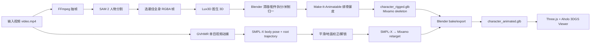

# 从已有视频到可用游戏角色：完整实施方案

更新日期：2026-08-14（调研版）

## 1. 结论

主线采用：

> 视频人物帧提取与分割 → Lux3D 图生静态 GLB → 模型清理与配件拆分 → Make-It-Animatable 自动生成 Mixamo 兼容骨架和蒙皮 → GVHMR 从原视频恢复世界坐标人体动作 → SMPL-X 到 Mixamo 骨架重定向 → Blender 烘焙并导出带动画 GLB → Three.js 与 Aholo 3DGS 场景混合展示。

这条路线的关键不是把所有步骤绑成一个不可拆分的模型，而是得到三类可复用中间资产：

1. `character_static.glb`：角色外观和材质；
2. `character_rigged.glb`：标准骨架、蒙皮、手持物 socket；
3. `motion_world.npz/json`：与人物外观无关的动作和根轨迹。

最后再把 2 和 3 合并成 `character_animated.glb`。因此同一个人物能换动作，同一段动作也能驱动别的人物，才符合“可用游戏角色”的定义。

不建议把 Assembly Agent 用于人物主链路。公司内部说明明确将它定位为多刚体拆件、旋转/平移和 URDF 生成，人物、动物等需要骨骼蒙皮的柔体模型属于当前不适用范围。它可以处理弓、机械装置、门、载具等独立道具。

## 2. 为什么选择这条主线

| 环节 | 首选 | 选择理由 | 兜底 |
| --- | --- | --- | --- |
| 人物提取 | FFmpeg + SAM 2 视频分割 | 保持整段视频人物 ID，一次提示传播到全视频 | `rembg`/RMBG 批处理 |
| 静态角色 | Lux3D 图生 3D | 比赛资源、PBR GLB、已得到可测试资产 | SiTH/ECON；已有高质量角色资产 |
| 自动绑骨 | Make-It-Animatable | 专门面向 humanoid；任意姿态可转 rest pose；输出 Mixamo 命名，便于动作复用 | Mixamo 手动五点；SkinTokens |
| 视频动捕 | GVHMR | 单目视频；输出 SMPL-X body pose、相机/世界坐标根轨迹；对移动相机也有处理 | Rokoko Vision/DeepMotion；仅 2D 骨架演示 |
| 重定向 | SMPL-X → Mixamo 固定映射 | 两端骨架语义已知，可自动化和复用 | Blender/Rokoko 插件半自动烘焙 |
| 展示 | Three.js + Aholo Viewer | GLB 骨骼动画和 3DGS 场景可在同一网页混合渲染 | 纯 Three.js 灰盒场景 |

Make-It-Animatable 的优势是“人物专用 + Mixamo 标准骨架”。SkinTokens 的自动绑骨质量和类别泛化更新，但它会自行生成骨架结构；对本项目而言，骨架越自由，后续从 SMPL-X 做动作重定向越难，所以 SkinTokens 是非标准人物或 MIA 失败时的第二选择。

## 3. `冰雪射手.glb` 资产体检

使用 `@gltf-transform/cli inspect/validate` 和 GLB JSON 解析得到：

| 项目 | 结果 |
| --- | --- |
| 文件大小 | 5,044,836 bytes，约 4.81 MiB |
| glTF | 2.0，校验无 error、warning |
| 场景/节点/网格 | 1 / 1 / 1 |
| Primitive | 1 个三角形 primitive |
| 顶点/三角形 | 54,391 / 59,972 |
| 顶点属性 | `POSITION`、`NORMAL`、`TEXCOORD_0` |
| 材质 | 1 个 PBR 材质 |
| 贴图 | Base Color 1024² PNG；Metallic-Roughness 1024² PNG |
| 骨骼/蒙皮 | 无 `skins`；无 `JOINTS_0/WEIGHTS_0` |
| Morph/动画 | 无 |
| 包围盒 | 约 0.1697 × 0.26 × 0.1593，需要在 Blender 中统一到米制身高 |

判断：文件本身是健康的静态 GLB，面数足以做网页/PC Demo，不必先重拓扑。第一轮应直接绑骨；只有出现肘、膝、腋下或裙摆严重塌陷时再处理拓扑和权重。

最大的实际风险是“人物与弓、箭袋、披风、长发是否已经焊在同一网格中”。硬质配件不能跟人体一起软蒙皮：

- 弓从身体网格分离，最终 parent 到 `RightHand` 或 `LeftHand` socket；
- 箭袋 parent 到 `Spine2`；
- 披风/长发 P0 阶段只给骨盆、胸椎少量刚性权重，后续再加 secondary bones；
- 弓弦变形用两根辅助骨或 morph target，不要用 Assembly Agent 驱动人体。

复查命令：

```bash
npx --yes @gltf-transform/cli inspect 冰雪射手.glb
npx --yes @gltf-transform/cli validate 冰雪射手.glb
```

## 4. 总体架构



GPU 推理和网页运行应分开：GPU DevBox 只处理离线任务，Demo 网页只读取预生成的 GLB/JSON/视频，不在答辩现场等待模型。

## 5. 可交付资产规范

最终角色资产至少满足：

- glTF 2.0/GLB；Y-up，右手坐标；单位为米；脚底在 `y=0`；角色朝 `+Z` 或项目固定方向；
- 1 个可变形 SkinnedMesh；每顶点最多 4 个骨骼影响；权重和为 1；
- 标准 humanoid 骨架，至少含 hips、3 段 spine、neck/head、双臂、双腿、feet；
- `Hips` 是动画根；额外保留 `Root`/`Armature` 节点用于场景摆放；
- 两种动画：`motion_world` 保留视频根轨迹，`motion_inplace` 去除 XZ 位移用于游戏循环；
- 独立 socket：`RightHandSocket`、`LeftHandSocket`、`BackSocket`；
- PC/Web Demo 保持 60k tris 可接受；需要移动端时再做 25k–40k tris LOD；
- PBR BaseColor/MetallicRoughness；如视觉允许，导出后用 KTX2 压缩贴图、Meshopt/Draco 压缩几何；
- 碰撞使用 capsule，不使用人物渲染网格做物理碰撞。

建议目录：

```text
assets/
├── source/
│   ├── video.mp4
│   └── source_meta.json
├── frames/
│   ├── rgba/
│   └── selected.png
├── character/
│   ├── character_static.glb
│   ├── character_clean.glb
│   ├── character_rigged.glb
│   └── attachments/
├── motion/
│   ├── gvhmr_result.pt
│   ├── motion_world.npz
│   ├── motion_world.json
│   └── motion_quality.json
├── final/
│   ├── character_animated.glb
│   ├── character_inplace.glb
│   └── manifest.json
└── previews/
    ├── overlay.mp4
    └── demo_fallback.mp4
```

## 6. 从零执行步骤

### 阶段 0：先跑通现有 GLB，不要先做视频人物重建

第一条必须跑通的最小闭环：

```text
冰雪射手.glb → 自动绑骨 → 默认走路动画 → Blender/网页播放
```

验收：输出文件存在 `skins`、`JOINTS_0`、`WEIGHTS_0`、20 个以上骨骼节点和至少一个动画；肩、肘、髋、膝各旋转 60°–90°不撕裂。

如果这一步没有完成，不要接 GVHMR。因为动捕质量再高也无法驱动坏蒙皮。

### 阶段 1：准备 GPU DevBox

本机没有可见 NVIDIA CUDA 环境，模型推理放到公司的 GPU DevBox：

1. BPM 申请单卡 NVIDIA GPU；主线推荐至少 24 GB 显存；若要跑 ActionMesh 默认模式，申请 32 GB 以上；
2. 创建时选择带 CUDA/PyTorch 的 GPU 镜像；每卡会分配 24 CPU/64 GiB RAM；
3. `/home/<用户名>` 是 50 GiB 持久盘。主线勉强可用，若同时保留 MIA、GVHMR、ActionMesh、Blender 和全部权重，建议扩到 100 GiB；
4. 暴露 Gradio/FastAPI 端口时进程监听 `0.0.0.0`；
5. `apt install` 的系统包不在 `/home`，安装后创建容器快照。

验证：

```bash
nvidia-smi
python3 -c "import torch; print(torch.cuda.is_available(), torch.cuda.get_device_name(0))"
df -h /home
```

为避免 PyTorch/CUDA 依赖冲突，MIA、GVHMR、SkinTokens、ActionMesh 各自使用独立虚拟环境，不要合成一个环境。

### 阶段 2：视频人物提取

#### 2.1 视频预检和抽帧

```bash
ffprobe -v error -show_entries stream=width,height,r_frame_rate,duration \
  -of default=noprint_wrappers=1 input.mp4

mkdir -p frames/raw
ffmpeg -i input.mp4 -vf "fps=6,scale='min(1280,iw)':-2" \
  -q:v 2 frames/raw/%06d.jpg
```

对角色建模只需选 1–4 张清晰帧；对动作恢复保留原始视频，不使用抽帧版本。

最佳建模帧评分规则：

- 全身完整、脚和头未出画；
- 手臂和身体之间、两腿之间有明显空隙；
- 运动模糊低；
- 遮挡低，武器不要挡住躯干；
- 人体在画面中面积大；
- 正面或 3/4 视角优先。

#### 2.2 SAM 2 视频分割

使用官方 SAM 2 video predictor：在首个清晰帧点击人物正点、背景负点，向前和向后传播 mask。输出带 alpha 的 RGBA PNG，以及用于动捕质检的轮廓叠加视频。

如果 SAM 2 集成来不及，P0 可以对选中的单帧用 `rembg`，但不要对每一帧独立分割后直接当连续 mask，独立推理容易闪烁和换 ID。

验收：发梢/披风可以有少量缺口，但脚、手、武器和躯干必须连贯；mask 不应包含地面大块阴影。

### 阶段 3：静态角色生成与精修

#### 3.1 Lux3D 首轮

先用产品 UI 而不是立即写 API：

1. 上传 `selected.png`；
2. 图生 3D，描述里明确“完整全身、四肢分开、单一角色、无底座、PBR、game character”；
3. 如输入帧是动作姿态，不强求先生成 T-pose；MIA 有 pose-to-rest 能力；
4. 下载 GLB；
5. 重复生成 2–3 个候选，优先选择轮廓正确、腋下/胯部不粘连、手脚完整的，不只比较正面贴图。

API 自动化放到闭环以后：`upload → Lux3D task → poll → download GLB`，接口字段以当日 Spatial Labs 文档为准，不在代码中臆造固定路径。

#### 3.2 Blender 清理

对 `character_static.glb`：

1. 导入后设定身高 1.65–1.80 m，`Ctrl+A` 应用 rotation/scale；
2. 将脚底移到 Y=0，人物中心放在原点；
3. `Merge by Distance` 只使用很小阈值，避免把手指、衣服和身体焊在一起；
4. 删除悬浮碎片，重算法线；
5. `Separate by Loose Parts`，把弓、箭袋、武器、底座拆出；
6. 不要为了“看起来更专业”立即 voxel remesh。它会破坏 UV、贴图和细节；
7. 只有大面积自交/粘连造成绑骨失败时，才做局部修补或 Quadriflow/外部重拓扑；
8. 导出 `character_clean.glb`，保留原始 PBR 贴图。

对于现有冰雪射手，60k tris 可直接进入第一轮绑骨。若网页帧率不足，再在已验证变形之后做 0.6–0.75 ratio decimate 并重新检查 UV 和权重。

### 阶段 4：自动绑骨与蒙皮

#### 4.1 首选 Make-It-Animatable

安装：

```bash
git clone https://github.com/jasongzy/Make-It-Animatable --recursive --single-branch
cd Make-It-Animatable
conda create -n mia python=3.11 -y
conda activate mia
pip install -r requirements.txt

git lfs install
GIT_LFS_SKIP_SMUDGE=1 git -C data clone https://huggingface.co/datasets/jasongzy/Mixamo
GIT_LFS_SKIP_SMUDGE=1 git clone https://huggingface.co/jasongzy/Make-It-Animatable /tmp/mia-hf
git -C data/Mixamo lfs pull -I 'bones*.fbx,animation'
git -C /tmp/mia-hf lfs pull -I output/best/new
mkdir -p output/best
cp -r /tmp/mia-hf/output/best/new output/best/
git -C /tmp/mia-hf lfs pull -I data
cp -r /tmp/mia-hf/data/* data/

wget https://github.com/facebookincubator/FBX2glTF/releases/download/v0.9.7/FBX2glTF-linux-x64 -O util/FBX2glTF
chmod +x util/FBX2glTF
python app.py
```

通过 Gradio 上传 `character_clean.glb`，依次检查：

1. coarse joints 是否都在身体内部；
2. rest pose 是否正常；
3. skin weight 可视化是否跨越左右肢体“串色”；
4. 默认动画是否稳定；
5. 下载/保存 FBX 及可视化 GLB。

MIA 代码使用 Mixamo 骨骼名字（例如 `Hips`、`LeftUpLeg`、`RightHand`），这正是后续固定重定向的基础。P0 可关闭 fingers，先保住 22–24 根主体骨；GVHMR 本身也不提供可靠手指时序。

#### 4.2 兜底 A：Mixamo

如果 MIA 在腋下、武器或极端比例上失败：

1. 上传清理后的角色；
2. 手动标注 chin、wrists、elbows、knees、groin 五类点；
3. 下载 T-pose FBX 和一条 walking 测试动画；
4. 下游仍使用同一套 Mixamo 骨骼映射，不需要改重定向程序。

这是最稳妥的人工保险，应在 Hackday 第一天就准备好一个成功版本。

#### 4.3 兜底 B：SkinTokens

SkinTokens 适合非标准人体、动物或 MIA 难例。官方要求 NVIDIA GPU 至少 14 GB、Python 3.11、CUDA 12.1+。

```bash
git clone https://github.com/VAST-AI-Research/SkinTokens.git
cd SkinTokens
uv venv --python 3.11
source .venv/bin/activate
uv pip install torch==2.7.0 torchvision==0.22.0 torchaudio==2.7.0 \
  --index-url https://download.pytorch.org/whl/cu128
uv pip install -r requirements.txt
uv pip install flash-attn --no-build-isolation
python download.py --model

python demo.py \
  --input /path/character_clean.glb \
  --output /path/character_rigged_skintokens.glb \
  --use_transfer --use_postprocess
```

注意：SkinTokens 生成的骨架不保证是 Mixamo 拓扑。需要额外建立语义映射，或用 IK 把 SMPL 关节点约束到它的骨骼，因此只作为第二选择。

### 阶段 5：从原视频提取动作

#### 5.1 输入视频要求

- 单人，持续全身可见；
- 720p/1080p、30/60 fps；
- 快门足够快，尽量少运动模糊；
- 如果相机固定，记录为 fixed camera；如果跟拍，保留背景纹理供视觉里程计估计；
- 建议单段 5–20 秒。长视频先按镜头切段，最后再拼动画。

#### 5.2 GVHMR 安装

```bash
git clone https://github.com/zju3dv/GVHMR
cd GVHMR
conda create -n gvhmr python=3.10 -y
conda activate gvhmr
pip install -r requirements.txt
pip install -e .
```

按官方目录放置模型：

```text
inputs/checkpoints/
├── body_models/smplx/SMPLX_NEUTRAL.npz
├── body_models/smpl/SMPL_NEUTRAL.pkl
├── gvhmr/gvhmr_siga24_release.ckpt
├── hmr2/epoch=10-step=25000.ckpt
├── vitpose/vitpose-h-multi-coco.pth
└── yolo/yolov8x.pt
```

SMPL 和 SMPL-X 需各自在 MPI 网站注册并接受许可，不能把模型文件直接提交到仓库。

固定相机：

```bash
python tools/demo/demo.py --video=/path/input.mp4 -s
```

移动相机：

```bash
python tools/demo/demo.py --video=/path/input.mp4
```

如果知道全画幅等效焦距，使用官方 `f_mm` 选项提高尺度/相机估计稳定性。每次运行保留 incam 和 global 对比视频；global 结果异常时先看 2D keypoints，而不是直接调重定向。

#### 5.3 导出可交换动作文件

GVHMR 结果的 `smpl_params_global` 至少保存：

- `body_pose`；
- `global_orient`；
- `transl`；
- `betas`；
- 视频 FPS、宽高、相机是否固定。

最小导出逻辑：

```python
import numpy as np
import torch

result = torch.load("outputs/demo/<clip>/hmr4d_results.pt", map_location="cpu")
p = result["smpl_params_global"]

def to_numpy(x):
    return x.detach().cpu().numpy() if hasattr(x, "detach") else np.asarray(x)

np.savez_compressed(
    "motion_world.npz",
    body_pose=to_numpy(p["body_pose"]),
    global_orient=to_numpy(p["global_orient"]),
    transl=to_numpy(p["transl"]),
    betas=to_numpy(p["betas"]),
    fps=np.float32(30.0),
)
```

实际键名随仓库版本复核；不要只保存逐帧 OBJ，那会丢失可复用骨骼动作并产生巨大文件。

### 阶段 6：动作清理

按以下顺序，避免后处理互相打架：

1. 统一输入 FPS 到 30；
2. 四元数符号连续化：相邻四元数点积小于 0 时对当前四元数取负；
3. 对根位移用 One Euro 或 Savitzky–Golay 轻度滤波；
4. 对关节旋转在四元数空间做轻度平滑，不直接平滑欧拉角；
5. 用左右脚踝/脚尖的速度与离地高度检测 contact；
6. contact 连续期间锁定脚的世界位置，用两骨 IK 修正髋、膝、踝；
7. 调整根 Y，使最低接触脚落在地面；
8. 生成 world 和 inplace 两版：inplace 只去掉 Hips 的 XZ 平移，保留上下起伏和朝向。

P0 可以先只做 1–4 和地面偏移；脚锁属于 P1，但必须保留开关，避免糟糕的接触判断反而破坏跳跃。

### 阶段 7：SMPL-X 到 Mixamo 重定向

主体骨映射：

| SMPL/SMPL-X | Mixamo |
| --- | --- |
| pelvis | Hips |
| left/right_hip | Left/RightUpLeg |
| left/right_knee | Left/RightLeg |
| left/right_ankle | Left/RightFoot |
| left/right_foot | Left/RightToeBase |
| spine1 | Spine |
| spine2 | Spine1 |
| spine3 | Spine2 |
| neck | Neck |
| head | Head |
| left/right_collar | Left/RightShoulder |
| left/right_shoulder | Left/RightArm |
| left/right_elbow | Left/RightForeArm |
| left/right_wrist | Left/RightHand |

不要把源局部四元数直接复制给目标骨骼。不同骨架的 bind pose、骨轴和父级变换不同。正确流程：

1. 预计算源骨架和目标骨架的 bind world rotation：`B_s(j)`、`B_t(j)`；
2. 将 GVHMR 坐标经固定轴变换 `C` 统一到 glTF Y-up；
3. 每帧得到源骨的 posed world rotation `P_s(j,t)`；
4. 计算相对 bind 的世界旋转增量：`D(j,t) = P_s(j,t) * inverse(B_s(j))`；
5. 施加到目标 bind：`P_t(j,t) = D(j,t) * B_t(j)`；
6. 根据目标父骨世界变换还原 local rotation；
7. Hips 位移乘以 `目标腿长 / SMPL 腿长`，再做地面对齐；
8. 在 Blender 30 fps 烘焙到 Action，曲线简化后导出 GLB。

内部 Blender 调研指出 glTF 只保存关节 transform，不保存“骨骼显示棒”的长度和可视朝向；导入后看起来朝向不同不等于动画错误。但重新导出会把 Blender 骨轴写回，所以本项目固定使用 Blender 导入方式，并保留 MIA 的 Y 轴骨向，避免在 Temperance/Fortune 等导入策略之间混用。

输出两条 Action：

- `video_world`：保留真实根轨迹，用于与原视频/3DGS 场景对齐；
- `video_inplace`：去根 XZ，用于角色控制器和循环预览。

手指、表情不进入 P0。若必须演示射箭：手指用 2–3 个手工关键帧；弓固定在手 socket；箭作为独立刚体沿预设曲线飞行。GVHMR 主体动作不应被迫承担它没有观测到的手指和道具状态。

### 阶段 8：Blender 烘焙与导出

导出前检查：

1. 角色静止 bind/rest pose 正常；
2. 所有 deform bones 的 scale 为 1；
3. 每顶点最多 4 个权重，归一化；
4. Action 时间范围与视频完全一致；
5. 根节点只负责场景 transform，Hips 负责 root motion；
6. 硬质配件 parent 到 socket，不参与软蒙皮；
7. 导出选中对象、animations、skinning、materials；
8. glTF Validator 无 error/warning；
9. 用 Three.js 播放一次，不以“Blender 里能播”作为最终验收。

导出后检查：

```bash
npx --yes @gltf-transform/cli inspect character_animated.glb
npx --yes @gltf-transform/cli validate character_animated.glb
```

检查结果必须包含 skin、`JOINTS_0/WEIGHTS_0` 和 animation。

### 阶段 9：网页 Demo 与 Aholo 场景

推荐页面布局：

- 左：原视频；
- 中：可旋转的动画角色；
- 右：骨架/轨迹/质量状态；
- 底：共用时间轴、world/inplace 切换、原视频/角色透明叠加；
- 背景：Aholo World 的 3DGS 空间；角色和弓使用 Three.js GLB。

同步时不要每帧累加 `delta`，而是把视频当主时钟：

```js
video.addEventListener('seeked', () => mixer.setTime(video.currentTime));

function render() {
  mixer.setTime(video.currentTime);
  renderer.render(scene, camera);
  requestAnimationFrame(render);
}
```

Aholo World 生成结果 JSON 的 `assets` 可提供 3DGS、碰撞 GLB 和物体 GLB。场景高斯负责视觉，碰撞 GLB/体素负责行走，动画人物单独加载到同一坐标系。第一版只需要手工设置一个 `worldFromCharacter` 4×4 transform；之后再用地面点和朝向标定。

Demo 运行时只加载预生成资产。后台 API 可以展示 job 状态，但答辩主流程不能现场触发 3D 生成或 GPU 推理。

## 7. ActionMesh 快速支线

ActionMesh 可以把 `{视频 + 冰雪射手.glb}` 直接变成一段带内嵌动画的 GLB，并保留现有拓扑和纹理：

```bash
git clone https://github.com/facebookresearch/actionmesh.git
cd actionmesh
git submodule update --init --recursive
pip install -r requirements.txt
pip install -e .

python inference/video_and_3d_to_animated_mesh.py \
  --input /path/clip.mp4 \
  --mesh_input /path/冰雪射手.glb \
  --blender_path /path/to/blender \
  --fast --low_ram
```

适用：做一个“45–75 秒直接从视频到 4D 角色”的对照展示，尤其适合非人动物和夸张角色。

不适合作为主交付：只接受 16–31 帧；输出 per-frame mesh/烘焙动画，不提供可复用的标准人体骨架；长动作、动作库、实时控制和网络传输都不如骨骼动画。它还是 FAIR Noncommercial Research License，输出也限制非商业用途。

## 8. 决策树和失败降级

```text
静态 GLB 是否四肢可分、轮廓完整？
├─ 否 → 重新选帧/Lux3D 重生；不要进入绑骨
└─ 是
   ├─ MIA 默认动画通过？
   │  ├─ 是 → 固化 Mixamo rig，进入 GVHMR
   │  └─ 否
   │     ├─ 是标准人形 → Mixamo 手动五点
   │     └─ 非标准/动物 → SkinTokens，改用 IK 语义重定向
   └─ GVHMR global overlay 是否稳定？
      ├─ 否 → 先查 detector/2D pose/固定相机开关/焦距
      └─ 是 → 重定向
         ├─ 肢体方向错 → bind/轴变换错误
         ├─ 人物漂移 → root scale/ground/contact 错误
         └─ 局部撕裂 → skin weights/硬质配件未分离
```

重要原则：

- 轮廓错误回到 3D 生成；
- 关节在身体外回到绑骨；
- 骨骼整体方向错修重定向；
- 关节附近拉丝修蒙皮；
- 脚滑修 root/contact，不要重新生成角色。

## 9. 验收门禁

| Gate | 必须满足 | 自动/人工检查 |
| --- | --- | --- |
| G0 静态资产 | glTF 无错误；全身完整；配件可拆 | validator + 旋转查看 |
| G1 绑骨 | skin/weights 存在；默认动作可播 | inspect + 关节压力测试 |
| G2 动捕 | incam/global overlay 与视频主体一致 | 并排视频 |
| G3 重定向 | 左右无反、关节无 180°翻转、根轨迹合理 | 骨架叠加 |
| G4 游戏资产 | 30 fps；world/inplace 两 clip；socket 可用 | Three.js 播放 |
| G5 场景集成 | 视频与 3D 时间误差 <100 ms；脚落地；可 seek | 交互测试 |
| G6 演示 | 断网仍能播放核心 Demo；有录屏 | 离线彩排 |

可量化质量指标：

- 动画帧数与视频换算后相差不超过 1 帧；
- 相邻骨骼四元数不得无故发生符号跳变；
- 站立接触阶段脚滑目标小于 5 cm；
- 地面穿透目标小于 3 cm；
- Web 首屏使用本地资产 10 秒内可交互；
- 中端独显/现代集显目标 30 fps 以上。

## 10. 24–36 小时 Hackday 排期

### 0–2 小时：资产和环境

- 申请/创建 GPU DevBox；
- 校验冰雪射手；
- 下载 Blender、MIA 和必要权重；
- 准备一个 Mixamo 成功资产作保险。

交付：`character_clean.glb`。

### 2–6 小时：绑骨最小闭环

- MIA 绑骨；
- 默认走路/挥手压力测试；
- 分离弓和箭袋；
- 导出 `character_rigged.glb`。

这是第一个生死门。6 小时仍未通过就立即切 Mixamo，不继续调模型。

### 6–12 小时：动捕

- 跑 GVHMR 官方样例确认环境；
- 跑目标视频；
- 生成 incam/global 对比；
- 导出 `motion_world.npz`。

### 12–18 小时：重定向

- 实现固定 SMPL-X→Mixamo 映射；
- 输出 world/inplace；
- 简单平滑和地面对齐；
- Blender 烘焙 GLB。

### 18–24 小时：网页和 Aholo

- Three.js 加载动画 GLB；
- 视频作为主时钟同步；
- 加入 Aholo 3DGS 场景或先用灰盒地面；
- 加骨架、轨迹、播放控制。

### 24–30 小时：从视频到角色外观

- SAM 2 分割关键帧；
- Lux3D 生成第二个角色；
- 用已固化流程替换角色，证明动作可复用。

### 30–36 小时：打磨和兜底

- ActionMesh 快速支线（仅有余力）；
- 脚锁、配件动画、KTX2/meshopt；
- 清缓存彩排；
- 录制 60–90 秒 fallback 视频；
- 把所有模型/API 调用结果落成本地资产。

## 11. 最终演示脚本

1. 播放 3–5 秒原视频；
2. 点击“提取人物”，展示 mask 和选中的人物帧；
3. 展示 Lux3D 静态模型以及“无骨骼”体检；
4. 切换骨架可视化，显示自动绑骨后的 Mixamo 骨骼；
5. 同一时间轴播放原视频和 3D 角色；
6. 旋转到侧面，证明动作不是 2D 贴片；
7. 打开 global trajectory 和脚接触点；
8. 把同一动作一键切换到第二个角色；
9. 将角色放进 Aholo 3DGS 场景，切换 world/inplace；
10. 最后显示导出的 `character_animated.glb` 可下载/可在 Three.js 中复用。

真正的“哇点”不是单个 AI 模型，而是同一个视频同时得到角色外观、可复用骨架、世界轨迹和可替换动作资产，并且能放进 Aholo 世界中运行。

## 12. 风险与许可

| 组件 | 许可/风险 | 处理 |
| --- | --- | --- |
| Make-It-Animatable | MIT | 可作为主绑骨工具；保留归属 |
| SkinTokens | MIT | 可作为备选；记录权重来源 |
| GVHMR | 教育、研究、非营利；商业使用需联系作者；修改分发有开源要求 | Hackday 研究 Demo 可用；产品化前法务确认 |
| SMPL/SMPL-X | 需注册；模型文件通常不可再分发 | 不入库，只在受控推理环境部署 |
| ActionMesh | FAIR Noncommercial Research License，研究材料和输出均不可商用 | 只做研究对照，不作为商业主链路 |
| Lux3D/Aholo | 依平台权益、积分、API 当日文档 | 预生成并缓存；Key 只放服务端环境变量 |
| 视频人物 | 肖像、版权和隐私 | 仅使用已授权人物/素材；公开 Demo 前确认授权 |

产品化时优先替换许可受限的 GVHMR/SMPL 环节，或取得商业授权；MIA/SkinTokens 的 MIT 许可不能自动覆盖其训练数据、外部模型或输入素材权利。

## 13. 参考资料

### 公司内部

- [Aholo Hackday 产品/API 支持](https://cf.qunhequnhe.com/pages/viewpage.action?pageId=81507925827)
- [可调用研发资源清单](https://cf.qunhequnhe.com/pages/viewpage.action?pageId=81507918322)
- [Assembly Agent 可动资产能力](https://cf.qunhequnhe.com/pages/viewpage.action?pageId=81512044107)
- [Actor 总体框架](https://cf.qunhequnhe.com/pages/viewpage.action?pageId=81507937921)
- [带骨骼 GLB 导入导出 Blender 的相关思考](https://cf.qunhequnhe.com/pages/viewpage.action?pageId=81507937737)
- [GPU DevBox 使用帮助](https://cf.qunhequnhe.com/pages/viewpage.action?pageId=81427178500)

### 开源/论文

- Make-It-Animatable：https://github.com/jasongzy/Make-It-Animatable
- SAM 2：https://github.com/facebookresearch/sam2
- GVHMR：https://github.com/zju3dv/GVHMR
- SkinTokens：https://github.com/VAST-AI-Research/SkinTokens
- UniRig：https://github.com/VAST-AI-Research/UniRig
- ActionMesh：https://github.com/facebookresearch/actionmesh
- SiTH：https://github.com/SiTH-Diffusion/SiTH
- ECON：https://github.com/YuliangXiu/ECON
- SAM 3D Body：https://github.com/facebookresearch/sam-3d-body
- MHR：https://github.com/facebookresearch/MHR
- glTF 2.0：https://github.com/KhronosGroup/glTF/tree/main/specification/2.0
